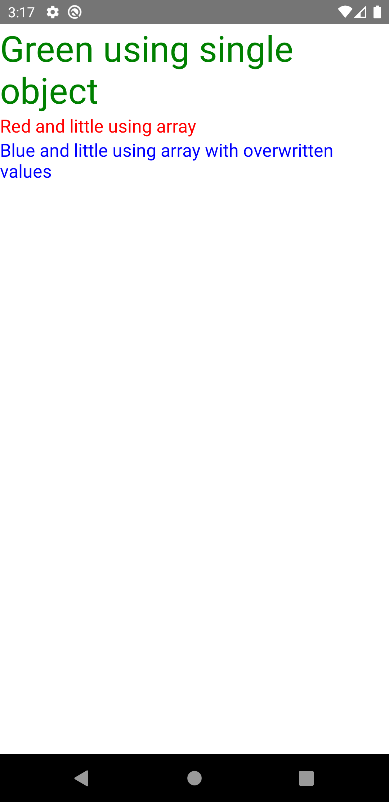

# react-native-style-helper
This package allows you to create compatible styles from your predefined styles and prop styles.

## Documentation
- [Preview](#preview)
- [Installation](#installation)
- [Why?](#why)
- [Usage](#usage)

### Preview


### Installation
Install the package using npm:
```shell
npm i --save react-native-style-helper
```
or using yarn:
```shell
yarn add react-native-style-helper
```

### Why?
When mixing own styles with prop styles, the parent component often has to pass a style object.
It would be better if there would be more variants to pass styles. This problem solves this package.
Currently, you can pass a style object, or an array of style objects.

### Usage
#### Example
Example on how to use this.

Create your component:
```ecmascript 6
export default function ExampleComponent(props) {
    // Destruct own props
    const { text, style, ...other } = props;
    
    return <Text {...other}>{text}</Text>;
}
```
Use `createStyles` to pass your styles

```ecmascript 6
export default function ExampleComponent(props) {
    // Destruct own props
    const { text, style, ...other } = props;
    
    return <Text style={createStyles(yourStyle, style)} {...other}>{text}</Text>;
}
```

#### Usage
This package basically only provides this function:
```ecmascript 6
createStyles
```

You pass all the styles in that (no matter whether they are style objects or array of style objects), and you get a
single style object back!

#### Note
Styles will be rewritten. The next style rewrites the current style.
